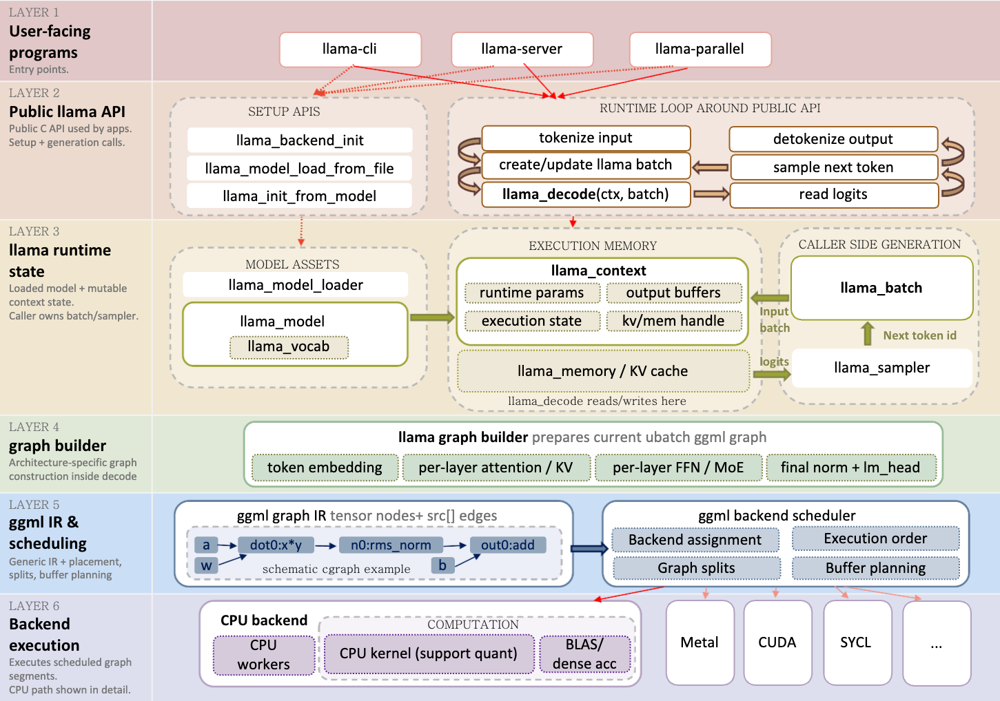

# llama-hpx

This repository is an experimental fork of `llama.cpp` used to study where HPX can help LLM inference and serving workloads.

The project started with the question:

```text
Can HPX improve parts of llama.cpp execution or serving by adding better runtime orchestration?
```

Across the branches, the work moved through three levels:

```text
1. thread-pool/runtime experiments around llama.cpp
2. HPX near ggml graph execution and prefill/decode orchestration
3. HPX outside ggml, at the serving request-orchestration layer
```

The current evidence suggests that HPX is useful for building and validating serving-runtime ideas, but simply inserting HPX as a replacement scheduler around an existing `llama.cpp` path does not automatically create a speedup.

The promising direction is to let HPX own **serving lifecycle capabilities** around llama.cpp:

```text
request futures
engine ownership
traceable lifecycle events
cooperative cancellation
future live admission
future priority / scheduling policies
```

`llama.cpp` remains the model execution layer.

HPX owns orchestration around it.

## Branch map

### `hpx-threadpool-experiment`

First exploration branch. This branch explored early HPX/thread-pool ideas around llama.cpp execution. It was the first attempt to understand where external runtime orchestration could fit and what kinds of overheads appear when llama.cpp work is wrapped by another scheduling layer.

Main lesson:

```text
Wrapping existing llama.cpp execution with another runtime is not enough by itself. The design has to expose real parallelism, overlap, cancellation, priority, or another useful scheduling capability.
```

### `hpx-prefill-orchestrator`

Second exploration branch.

This branch moved closer to ggml graph execution. It explored HPX prefill orchestration, selective execution, packetized fine-region execution, and run-level graph ideas.

Topics explored included:

```text
ggml graph structure
prefill vs decode behavior
selective lowering
fine-region DAGs
packetized repeated subgraphs
run-level execution planning
interaction with ggml scheduler and CPU backend paths
```

Main lesson:

```text
HPX could execute some lowered or packetized regions correctly, but the tested CPU-only designs did not beat the existing llama.cpp / ggml scheduler. The overhead and granularity were not favorable when HPX was inserted inside or near ggml graph execution.
```

### `hpx-run-level-analyzer`

This branch moved HPX out of ggml graph execution and into serving/runtime orchestration.

It contains two serving-level lines of work:

```text
1. FIFO context-pool serving-bench line
2. Continuous-batching request-lifecycle line
```

The FIFO serving-bench line compared:

```text
llama-serving-bench --backend std
vs.
llama-serving-bench --backend hpx
```

That path was correct and robust, but it did not show a useful HPX latency advantage. It is now closed out.

The current successful direction is the continuous-batching line:

```text
pure llama.cpp multi-seq shared-batch gate
HPX continuous-batching orchestration gate
per-request HPX futures/promises
traceable lifecycle events
cooperative cancellation
```

Main lesson:

```text
HPX becomes more meaningful when it owns a serving lifecycle capability, not when it merely replaces a FIFO queue around opaque llama_decode calls.
```
## Current result in one paragraph

The current branch proves that a real `llama.cpp` multi-sequence shared-batch shape can run with 99 active `seq_id`s and mixed decode budgets `{8,64,256}`. It then proves that HPX can wrap that primitive with a single engine task, per-request futures/promises, lifecycle traces, descriptive metrics, and cooperative cancellation. The HPX prototype matches the pure llama.cpp reference on same-shape correctness fields. No HPX speedup is claimed.

---

## Upstream llama.cpp sketch

This is the simplified mental model used in the HPX design notes.




## What this repository is studying

This repository is not trying to replace `llama.cpp` kernels.

The main questions are:

- Where can HPX sit around llama.cpp without breaking correctness?
- What granularity is too fine for HPX to help?
- When does HPX orchestration become overhead instead of useful scheduling?
- What evidence is needed before claiming a runtime-level improvement?
- What HPX-native serving features can create a real functional advantage?


The project keeps correctness checks central:

- same model
- same prompt
- same batch shape when comparing hashes
- same decoding policy
- token-hash checks
- per-seq KV cleanup checks
- trace-based lifecycle checks
- repeatable benchmark protocols

Important hash rule:

Long-budget hashes can depend on batch shape.
Do not compare budget-64 or budget-256 hashes across different batch shapes.
Use same-shape repeat determinism and within-run same-class hash equality.

---
## Repository guide

### HPX design and notes

HPX-related design notes and reports live under:

```text
docs/hpx/
```

Useful current documents include:

```text
docs/hpx/provenance.md
docs/hpx/continuous_batching_upstream_notes.md
docs/hpx/continuous_batching_simulator_design.md
docs/hpx/continuous_batching_phase3_target.md
docs/hpx/multiseq_llama_batch_gate.md
docs/hpx/hpx_continuous_batching_prototype_design.md
docs/hpx/hpx_continuous_batching_cancellation_design.md
docs/hpx/continuous_batching_gate_closeout.md
docs/hpx/continuous_batching_live_admission_design.md
```

`continuous_batching_live_admission_design.md` is design-only next work. Live admission is not implemented yet.

---

### Benchmark and simulator evidence

Benchmark and simulator evidence lives under:

```text
hpx-bench/
```

Important subdirectories:

```text
hpx-bench/experiments/
hpx-bench/sim/
```

The `experiments/` tree contains serving-bench evidence packages such as:

```text
10_perf_heterogeneous_budgets/
11_perf_deep_queue_short_requests/
```

These support the FIFO context-pool closeout.

The `sim/` tree contains the continuous-batching simulator and workload analysis that led to the mixed-decode target.

---

### Pure llama.cpp multi-seq reference gate

The pure llama.cpp reference gate lives under:

```text
tools/multiseq-batch-gate/
```

It proves the target execution primitive without HPX:

- one llama_model
- one llama_context
- many seq_ids
- one shared llama_batch
- mixed decode budgets {8,64,256}
- per-seq KV clear
- repeat determinism


This tool is the correctness reference for the HPX continuous-batching prototype.

---

### HPX continuous-batch gate

The HPX orchestration prototype lives under:

```text
tools/hpx-continuous-batch-gate/
```

It proves:

- one HPX engine task owns the llama.cpp execution loop
- one HPX future/promise pair per request
- main validates request_result snapshots only
- trace events are env-gated
- cooperative cancellation completes futures with status=cancelled


This is the current HPX-native serving prototype.

It is correctness-first and lifecycle-first.

It is not a benchmark and does not claim speedup.

---

### Earlier serving benchmark source

The earlier serving benchmark source lives under:

```text
tools/serving-bench/
```

This contains the std and hpx FIFO context-pool backends, request harness, and benchmark CLI.

The historical comparison was:

llama-serving-bench --backend std
llama-serving-bench --backend hpx


That line is now evidence for the FIFO closeout, not the current active direction.
