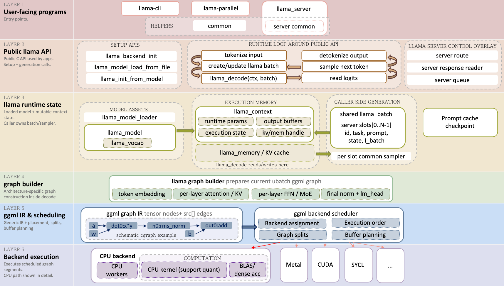
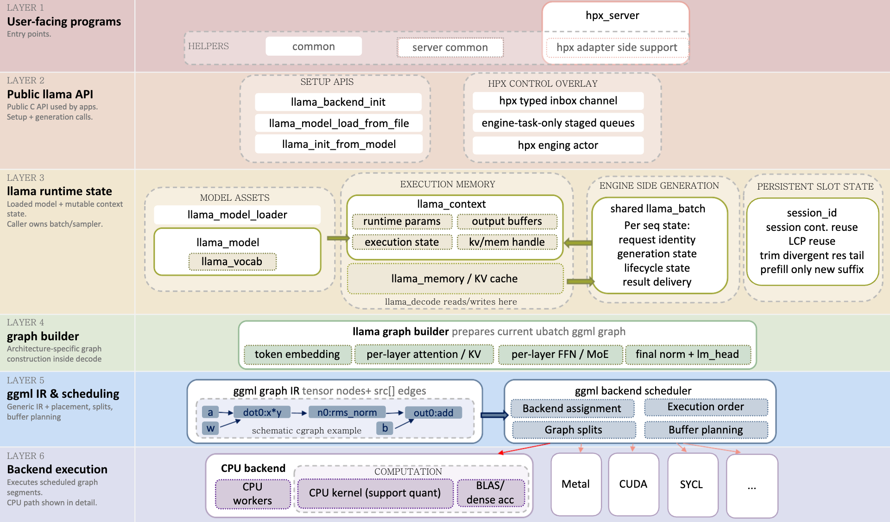

# llama-hpx

`llama-hpx` is an experimental fork of [`llama.cpp`](https://github.com/ggerganov/llama.cpp) used to study where the [HPX](https://github.com/TheHPXProject/hpx) runtime can help LLM inference serving.

The short version:

llama.cpp runs the model.
HPX owns the serving-control layer around it.


This repository is **not** trying to replace llama.cpp kernels, tensor math, tokenizer logic, sampler math, or backend execution. The useful direction found so far is to use HPX for request orchestration around llama.cpp: ownership, futures, cancellation, streaming, admission, batch-composition policy, runtime placement, and correctness validation.

---

## Why this exists

The starting question was:

Can HPX improve llama.cpp inference by adding better runtime orchestration?


Several approaches were explored:

1. wrapping existing llama.cpp execution with HPX/thread-pool scheduling,
2. inserting HPX closer to ggml graph execution,
3. moving HPX above llama.cpp, into the serving request lifecycle.

The first two directions taught an important lesson: simply placing another scheduler around existing llama.cpp execution does not automatically help. The granularity is often wrong, the overhead is visible, and llama.cpp already has strong execution paths.

The current direction is different.

Instead of trying to replace llama.cpp execution, this branch treats llama.cpp as the model execution layer and builds an HPX-native serving-control layer around it.

---

## Current result

The current `hpx-run-level-analyzer` branch demonstrates a correctness-first HPX serving prototype with:

- one engine task owning mutable llama.cpp execution state,
- typed HPX inbox messages for submit/cancel/shutdown,
- one `llama_context` and shared `llama_batch` execution shape,
- per-request HPX futures/promises,
- cooperative cancellation,
- live request admission,
- per-request token streaming,
- traceable lifecycle events,
- optional HPX runtime placement for the engine task,
- serving-side batch-composition policy,
- optional prefill budgeting for live-admitted requests,
- per-iteration diagnostics for attribution,
- regression smokes for default-pool and engine-pool scheduling paths,
- benchmark gates that verify output stability.

The key design rule is:

Only the engine-owned execution path touches llama.cpp mutable state.


Adapters, HTTP handlers, benchmark drivers, and producer tasks do not call `llama_decode` or mutate KV state directly. They send messages to the engine and consume futures or token streams.

The current prototype also includes an experimental `PrefillBudgetPolicy`. With the default budget disabled, behavior remains unbounded. With a positive prefill budget, the HPX serving layer caps how many live-admitted prompt rows may enter one engine iteration. This is a serving-control mechanism above `llama_decode`; it does not change ggml, backend kernels, tokenizer behavior, sampler math, or KV internals.

The validated claim is narrow: prefill budgeting can bound per-iteration prefill/decode interference. It is not a throughput claim and it is not a default-enable recommendation.

The current branch also includes the final hpx-server occupancy/offered-load closeout. The earlier c=4 hpx-server vs llama-server throughput gap was traced to request residency under a closed-loop workload, not HPX orchestration overhead. Under offered load with n_seq_max=4, max_concurrent=16, and 16 clients, the existing HPX backlog/admission machinery kept mean active_seq_count at 4.000/4 whenever the queue was non-empty. The c4 contrast had an empty queue and lower occupancy. The conclusion is to stop this branch as a performance-competition project: Design A, backlog admission, is already effectively implemented; the plausible future lever is Design B, persistent slots / prefix-KV reuse, as a separate project.

Design B was then explored as a scoped POC. A B0 measurement (using `llama-server` `cache_prompt` as an upper-bound reference) confirmed prefix reuse is worth pursuing, and a B1 implementation added optional `session_id` exact-session persistent-slot reuse to the HPX engine: a same-session request whose prompt exactly extends a resident slot skips the matched prefix prefill. B1 is exact-session-continuation reuse only — not a general shared-prefix cache. In the measured W-chat continuation cell, exact-session reuse reduced TTFT p50 from 567.6 ms to 78.3 ms and improved tok/s by 10.7%, while preserving byte-identical outputs. It does not capture the shared-system-prompt upside that B0 measured for W-long-sys and W-repeat-prefix; those need a separate longest-common-prefix (Design B+) follow-on. Use `session_id` only for genuine continuations. This is not a production-readiness claim and not a claim that HPX broadly outperforms `llama-server`.

A B+1 follow-on then added same-session longest-common-prefix (LCP) reuse: a same-session request that shares a common prefix with a resident slot keeps the matched prefix, trims the divergent resident tail, and prefills only the new suffix (same-session only; no cross-session reuse, `seq_cp`, or context shift). B+1 recovered the shared-prefix upside B1 missed (W-long-sys tok/s +40.2%, W-repeat-prefix +52.0%, W-chat +26.8%, W-control neutral). LCP reuse is structurally correct and performance-positive, but output is not guaranteed byte-identical to a fresh full-prefill under partial-LCP reuse: one of 40 W-repeat-prefix requests diverged, traced to deterministic cross-shape floating-point greedy near-tie sensitivity (correct KV positions and trim; no KV contamination), not a bug.

What this means for the performance path: the HPX serving-control / backlog / admission question is closed — under offered load HPX already keeps all slots full — so this branch should not be continued as a generic performance-competition track, and more tuning of admission, backlog, the HTTP handler, or orchestration is not the right lever. If the goal is performance, the evidence-backed direction is a separate prefix-cache / persistent-slot project. The two are distinct: backlog/admission keeps batches full when queued work exists, whereas a prefix cache avoids recomputing repeated prompt prefixes. Within that prefix-reuse line, exact-session continuation reuse and same-session LCP reuse already show real gains; cross-session LCP is deferred as a separate policy decision because cross-session cache hits can create a timing side channel. None of this is a production-readiness claim or a claim that HPX broadly outperforms `llama-server`.

See:

```text
docs/hpx/hpx_server_occupancy_offered_load_closeout.md
docs/hpx/hpx_exact_session_prefix_reuse_poc.md
docs/hpx/hpx_same_session_lcp_reuse_poc.md
```

---

## What HPX owns

HPX is used for the serving-control plane:

- request submission and completion,
- futures/promises,
- cooperative cancellation,
- typed engine inbox,
- engine actor ownership,
- token-stream delivery,
- admission and batch-composition policy,
- prefill budgeting,
- lifecycle traces,
- per-iteration diagnostics,
- runtime placement,
- correctness and regression gates.

The engine behaves like an actor:

```text
producers/adapters
      |
      v
HPX inbox channel
      |
      v
single engine task
      |
      v
llama.cpp decode / sampling / KV state
      |
      v
futures + token streams back to callers
```

This actor boundary is the main contribution of the current branch.

---

## What llama.cpp still owns

llama.cpp remains responsible for:

- model loading,
- tokenization,
- `llama_context`,
- `llama_batch`,
- `llama_decode`,
- logits,
- sampler behavior,
- KV-memory operations,
- graph construction,
- ggml scheduling,
- ggml graph execution,
- CPU / Metal / BLAS / backend kernels.

This repository does not claim that HPX should replace those pieces.

---

## Current architecture

The serving prototype is organized around five conceptual layers plus the process/runtime layer:

```text
Layer 0: Process / HPX runtime lifecycle
Layer 1: Adapter boundary
Layer 2: Runtime placement
Layer 3: Engine actor
Layer 4: Engine phase contracts
Layer 5: Future/dataflow evolution
```

The most important rules are:

- process entry owns `hpx::start`, `hpx::finalize`, and resource partitioning;
- engine objects never start or stop HPX;
- adapters submit requests and consume streams, but do not mutate llama.cpp state;
- the engine actor owns llama.cpp mutable state;
- cancellation is observed only at engine iteration boundaries;
- future/dataflow rewrites must preserve the already-validated phase order.

See:

```text
docs/hpx/hpx_serving_layer_architecture.md
```

for the durable architecture reference.

---

## Upstream llama.cpp sketch

This is the simplified mental model used in the HPX design notes.



In this project, HPX is placed around the serving/request lifecycle, not inside llama.cpp kernels. The important boundary is:

HPX:
  request lifecycle, futures, cancellation, streaming, placement,
  admission, batch-composition policy, prefill budgeting

llama.cpp:
  model execution, llama_decode, logits, sampling, KV operations, backends


---

## Current serving prototype

The main active prototype lives under:

tools/hpx-continuous-batch-gate/


It demonstrates:

- an HPX local-channel inbox for engine messages,
- engine-task-only staged queues,
- a single owner for llama.cpp execution state,
- per-request futures/promises,
- per-request token streams,
- cooperative cancellation,
- live admission and sequence reuse,
- named per-iteration phase helpers,
- optional `--engine-pool` runtime placement in the gate,
- placement-aware pump cooperativity,
- queued-cancel regression smokes for both default-pool and engine-pool behavior,
- chunked live-admission prefill under an explicit prefill budget,
- cancellation and concurrent-sequence smokes for the chunked-prefill path.

This tool is correctness-first and lifecycle-first.

It is not a speed benchmark.

---


## Branch map

### `hpx-threadpool-experiment`

First exploration branch.

This branch explored early HPX/thread-pool ideas around llama.cpp execution.

Main lesson:

Wrapping existing llama.cpp execution with another runtime is not enough.
The design must expose real overlap, cancellation, priority, admission,
or another useful scheduling capability.


### `hpx-prefill-orchestrator`

Second exploration branch.

This branch explored HPX closer to ggml graph execution: prefill orchestration, selective execution, packetized fine-region execution, and run-level graph ideas.

Topics explored included:

ggml graph structure
prefill vs decode behavior
selective lowering
fine-region DAGs
packetized repeated subgraphs
run-level execution planning
interaction with ggml scheduler and CPU backend paths


Main lesson:

HPX could execute some lowered or packetized regions correctly, but the
tested CPU-only designs did not beat the existing llama.cpp / ggml
scheduler. The overhead and granularity were not favorable.


### `hpx-run-level-analyzer`

Current active branch.



This branch moved HPX out of ggml graph execution and into serving/runtime orchestration.

It contains two serving-level lines of work:

1. FIFO context-pool serving-bench line
2. Continuous-batching request-lifecycle line


The FIFO serving-bench line compared:

llama-serving-bench --backend std
llama-serving-bench --backend hpx


That path was correct and robust, but it did not show a useful HPX latency advantage. It is now evidence for the FIFO closeout, not the active direction.

The active direction is the continuous-batching serving-control layer under:

tools/hpx-continuous-batch-gate/

Main lesson:

HPX becomes more meaningful when it owns a serving lifecycle capability,
not when it merely replaces a FIFO queue around opaque llama_decode calls.

---

## Repository guide

### HPX design and notes

HPX-related design notes and reports live under:

```text
docs/hpx/
```

Useful current documents include:

```text
docs/hpx/provenance.md
docs/hpx/hpx_serving_layer_architecture.md
docs/hpx/hpx_serving_layer_m0_m8_milestone_summary.md
docs/hpx/hpx_native_serving_control_plane_design.md
docs/hpx/serving_overhead_diagnostics_roadmap.md
docs/hpx/prefill_budget_policy_design.md
docs/hpx/prefill_budget_policy_result.md
docs/hpx/hpx_server_occupancy_offered_load_closeout.md
docs/hpx/hpx_exact_session_prefix_reuse_poc.md
docs/hpx/hpx_same_session_lcp_reuse_poc.md
docs/hpx/continuous_batching_upstream_notes.md
docs/hpx/continuous_batching_simulator_design.md
docs/hpx/continuous_batching_phase3_target.md
docs/hpx/multiseq_llama_batch_gate.md
docs/hpx/hpx_continuous_batching_prototype_design.md
docs/hpx/hpx_continuous_batching_cancellation_design.md
docs/hpx/continuous_batching_gate_closeout.md
docs/hpx/continuous_batching_live_admission_design.md
```

The architecture document is the best starting point for the current design:

```text
docs/hpx/hpx_serving_layer_architecture.md
```

The milestone summary records the validated serving-layer history:

```text
docs/hpx/hpx_serving_layer_m0_m8_milestone_summary.md
```

The prefill-budget documents record the current HPX-owned batch-composition policy and the server-path validation result:

```text
docs/hpx/prefill_budget_policy_design.md
docs/hpx/prefill_budget_policy_result.md
```

---

### HPX continuous-batch gate

The HPX orchestration prototype lives under:

```text
tools/hpx-continuous-batch-gate/
```

It proves:

- one HPX engine task owns the llama.cpp execution loop,
- producers communicate through a typed HPX local channel,
- engine messages are staged and processed at phase boundaries,
- one HPX future/promise pair completes each request,
- token streams are per request,
- cooperative cancellation completes futures with `status=cancelled`,
- live admission and sequence reuse are validated,
- optional engine-pool placement is supported in the gate,
- placement-specific queued-cancel behavior is guarded by smokes,
- live-admitted long prefill can be chunked under an explicit budget,
- chunked-prefill cancellation, concurrent overlap, and same-shape determinism are guarded by smokes.

This is the current HPX-native serving prototype.

---

### Pure llama.cpp multi-seq reference gate

The pure llama.cpp reference gate lives under:

```text
tools/multiseq-batch-gate/
```

It proves the target execution primitive without HPX:

- one `llama_model`,
- one `llama_context`,
- many `seq_id`s,
- one shared `llama_batch`,
- mixed decode budgets,
- per-seq KV clear,
- repeat determinism.

This tool is the correctness reference for the HPX continuous-batching prototype.

---

### Benchmark and simulator evidence

Benchmark and simulator evidence lives under:

```text
hpx-bench/
```

Important subdirectories:

```text
hpx-bench/experiments/
hpx-bench/sim/
```

The `experiments/` tree contains serving-bench evidence packages and server-vs-server comparison runs. Recent serving-layer responsiveness and comparison work:

- `hpx-bench/experiments/13_control_plane_responsiveness/` — internal HPX control-plane responsiveness; shows engine-pool improves queued-cancel tail latency but not decode-dominated streaming.
- `hpx-bench/experiments/14_hpx_server_end_to_end_responsiveness/` — end-to-end hpx-server client-visible responsiveness; records hpx-server responsiveness behavior and later slot-recovery refreshes.
- `hpx-bench/experiments/15_hpx_vs_llama_server_semantics/` — semantic-alignment revalidation against `llama-server`; useful for comparison setup, but not a throughput benchmark.
- `hpx-bench/experiments/16_prefill_budget_policy_server_w1c/` — server-path PrefillBudgetPolicy validation; shows that an HPX-owned prefill budget can bound per-iteration prefill/decode interference.
- `hpx-bench/experiments/17_hpx_vs_llama_server_throughput_smoke/` — small external throughput/scaling smoke for `llama-server` vs `llama-hpx-server` with default B=0; initially exposed the c=4 attribution target later resolved by the occupancy/offered-load closeout.

The final occupancy/offered-load POC showed that the existing HPX backlog/admission machinery fills all active slots when queued work exists, so the previous c=4 loss was a closed-loop no-work-ready artifact rather than an HPX admission defect. See `docs/hpx/hpx_server_occupancy_offered_load_closeout.md`.

The `sim/` tree contains the continuous-batching simulator and workload analysis that helped define the mixed-decode target.

---

### Earlier serving benchmark source

The earlier serving benchmark source lives under:

```text
tools/serving-bench/
```

This contains the std and hpx FIFO context-pool backends, request harness, and benchmark CLI.

The historical comparison was:

```text
llama-serving-bench --backend std
llama-serving-bench --backend hpx
```

That line is now evidence for the FIFO closeout, not the current active direction.

---
